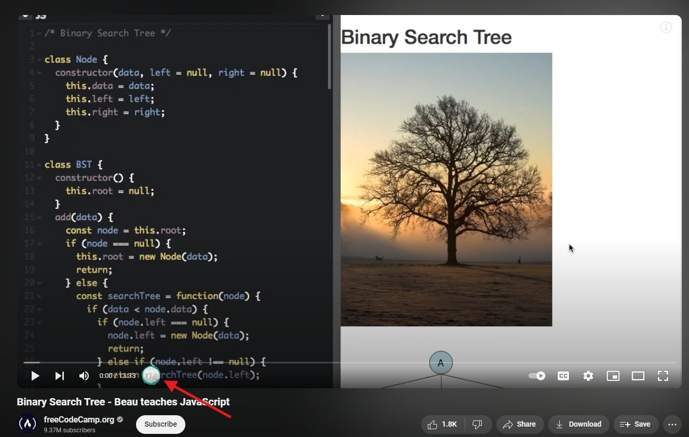
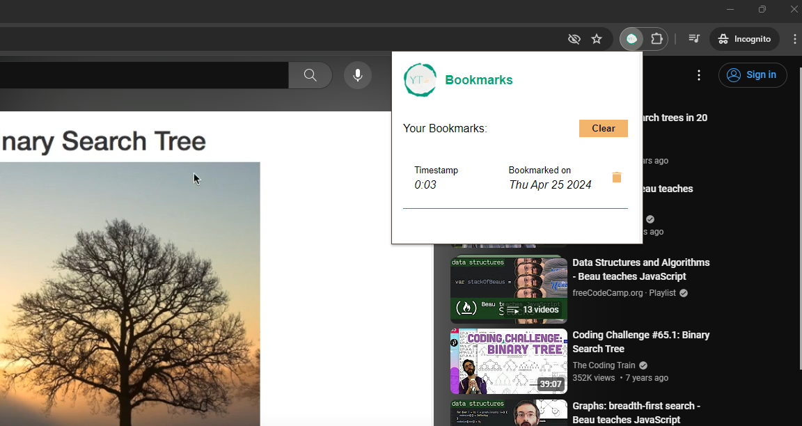

# Instruction

## Bookmarks

A simple Youtube timestamp bookmarker.

### How to use?

- Open your favorite Youtube video.
- As soon as video is loaded, you should see the bookmark icon near the timestamp.

  

- Clicking the bookmark icon should bookmark the video's current timestamp.
- To view you bookmarks for current video. Click on the extension icon.

  

- To resume your video from any of the available bookmarks, simply click on it.
